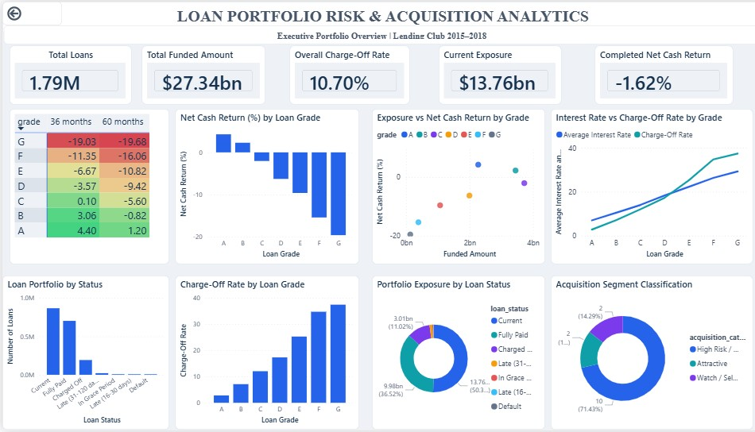
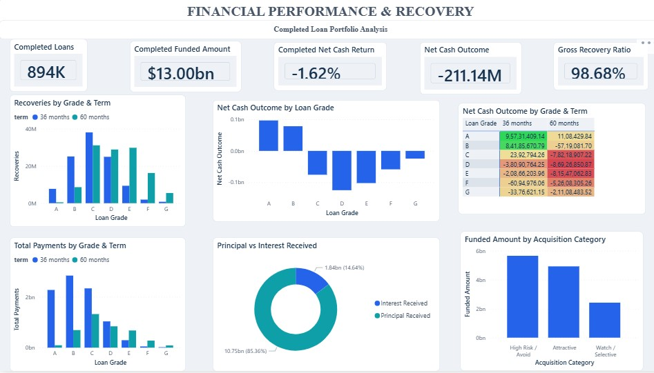
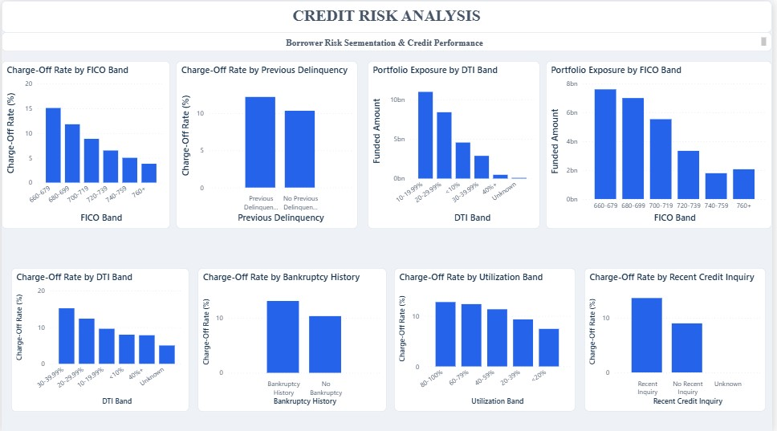

# Loan Portfolio Risk & Acquisition Analytics

### Python • SQL • Power BI • DAX • Financial Analytics • Credit Risk

An end-to-end data analytics project analyzing a large Lending Club loan portfolio to understand **portfolio exposure, financial performance, recovery, acquisition quality, and borrower credit risk**.

---

## 📊 Project Overview

This project analyzes approximately **1.79 million Lending Club loans** across **56 fields** covering the **2015–2018** period.

The analysis combines:

- **Python** for data preparation, exploratory analysis, portfolio profiling, and financial analysis
- **DuckDB SQL** within Google Colab for analytical segmentation and validation
- **Power BI** for interactive dashboard development
- **DAX** for portfolio, performance, recovery, and risk KPIs

The final deliverable is a **3-page Power BI dashboard** designed to translate large-scale lending data into actionable portfolio and credit-risk insights.

---

## 🎯 Business Problem

A lending portfolio can generate significant funding volume while still producing weak financial outcomes when credit losses, borrower characteristics, loan structure, and acquisition quality are not properly evaluated.

The purpose of this project is to identify:

- Which loan grades and borrower segments exhibit higher credit risk
- How loan term affects financial performance
- Which borrower characteristics are associated with higher charge-off rates
- Where portfolio and acquisition exposure is concentrated
- How recoveries, payments, and cash outcomes affect completed-loan performance

---

## 🎯 Project Objectives

- Analyze overall portfolio size and funded exposure
- Evaluate loan-status composition
- Measure charge-off patterns across loan grades
- Compare financial performance across loan grades and loan terms
- Analyze recoveries, payments, principal, interest, and net cash outcomes
- Evaluate acquisition categories and funded exposure
- Segment borrower risk using FICO, DTI, delinquency, bankruptcy, utilization, and recent credit inquiry indicators
- Build an executive-friendly Power BI dashboard for portfolio and risk analysis

---

## 🛠️ Tools & Technologies

| Tool | Purpose |
|---|---|
| **Python** | Data preparation, EDA, portfolio profiling and financial analysis |
| **Pandas / NumPy** | Data manipulation and numerical analysis |
| **DuckDB SQL** | SQL-based portfolio, risk, financial and acquisition analysis |
| **Power BI** | Interactive dashboard and data visualization |
| **DAX** | KPI and analytical measures |
| **Google Colab** | Python and SQL development environment |

---

## 🔄 Analytical Workflow

```text
Lending Club Loan Data
          ↓
Data Preparation & Profiling
          ↓
Python EDA & Financial Analysis
          ↓
DuckDB SQL Analysis & Validation
          ↓
Power BI Data Model + DAX
          ↓
3-Page Interactive Dashboard
          ↓
Key Insights & Business Recommendations
```

---

# 📈 Power BI Dashboard

The final Power BI report contains three analytical pages.

## 1. Executive Portfolio Overview

Focuses on the overall portfolio and acquisition picture.

**Key areas:**
- Total loans
- Funded amount
- Overall charge-off rate
- Current exposure
- Net cash return
- Loan-status composition
- Grade-level performance
- Grade × Term analysis
- Acquisition segmentation

### Dashboard Preview



---

## 2. Financial Performance & Recovery

Focuses on completed-loan financial performance and cash outcomes.

**Key areas:**
- Completed loans
- Completed funded amount
- Completed net cash return
- Net cash outcome
- Gross recovery ratio
- Recoveries by grade and term
- Total payments
- Principal vs. interest received
- Funded amount by acquisition category
- Grade × Term net cash outcome

### Dashboard Preview



---

## 3. Credit Risk Analysis

Focuses on borrower-level risk segmentation.

**Key areas:**
- FICO band
- DTI band
- Previous delinquency
- Bankruptcy history
- Revolving utilization
- Recent credit inquiry
- Charge-off rates across risk segments
- Portfolio exposure by risk segment

### Dashboard Preview



---

# 📌 Key Portfolio KPIs

| Metric | Dashboard Value |
|---|---:|
| Total Loans | ≈ 1.79M |
| Total Funded Amount | ≈ $27.34B |
| Overall Charge-Off Rate | ≈ 10.70% |
| Completed Loans | ≈ 894K |
| Completed Funded Amount | ≈ $13.00B |
| Completed Net Cash Return | ≈ −1.62% |
| Completed Net Cash Outcome | ≈ −$211.14M |
| Gross Recovery Ratio | ≈ 98.68% |
| Current Exposure | ≈ $13.76B |

> Values shown with `≈` are rounded/approximate dashboard values for portfolio presentation.

---

# 🔍 Key Insights

### 1. Portfolio scale does not guarantee attractive returns

The portfolio contains approximately **1.79M loans and $27.34B in funded exposure**, while completed loans show approximately a **−1.62% net cash return** and **−$211.14M net cash outcome**.

This highlights the importance of evaluating credit performance and cash economics rather than funding volume alone.

### 2. Loan grade is a major risk and performance differentiator

Charge-off rates increase materially as loan grade deteriorates, while net cash returns move from positive for stronger grades to increasingly negative for weaker grades.

### 3. Longer terms generally weaken net cash performance

The Grade × Term analysis indicates weaker net cash returns for longer-term loans, particularly among middle- and lower-grade segments.

### 4. FICO provides a strong borrower-risk signal

Lower FICO bands show materially higher observed charge-off rates than higher FICO bands.

### 5. Borrower characteristics provide additional risk signals

DTI, previous delinquency, bankruptcy history, revolving utilization, and recent credit inquiries show meaningful differences in observed charge-off rates.

### 6. Acquisition quality is a material portfolio consideration

The acquisition analysis identifies substantial funded exposure in the **High Risk / Avoid** category, highlighting the importance of acquisition screening and capital allocation.

---

# 💡 Business Recommendations

1. **Strengthen risk-based acquisition screening** by evaluating combinations of loan grade and borrower characteristics rather than relying on a single variable.

2. **Apply tighter underwriting or exposure limits** to weaker loan grades with persistently high charge-off rates and negative cash returns.

3. **Evaluate loan term jointly with credit quality**, since longer terms can weaken financial performance, particularly among weaker grades.

4. **Use behavioural indicators in risk monitoring**, including delinquency history, bankruptcy history, revolving utilization and recent credit inquiries.

5. **Review acquisition allocation** where substantial funding is concentrated in higher-risk acquisition categories.

6. **Monitor both credit-risk and cash-return metrics** so portfolio growth is not evaluated independently of financial performance.

---

# 🧮 DAX & Power BI

The dashboard uses DAX measures for:

- Overall charge-off rate
- Completed loans
- Completed funded amount
- Completed net cash return
- Completed net cash outcome
- Gross recovery ratio
- Recovery analysis
- Grade × Term financial analysis

Power BI techniques demonstrated include:

- KPI cards
- Conditional formatting
- Grade × Term matrix analysis
- Bar and column charts
- Donut charts
- Business-friendly field naming
- Multi-page dashboard design
- Financial and credit-risk visual storytelling

---

# 🗄️ SQL Analysis

SQL analysis was performed using **DuckDB within Google Colab**.

The prepared loan dataframe was registered as a SQL table and queried for:

- Portfolio overview
- Loan-status analysis
- Grade-level credit risk
- Loan-term analysis
- FICO analysis
- DTI analysis
- Previous delinquency
- Bankruptcy history
- Recent credit inquiries
- Revolving utilization
- Financial performance
- Recoveries
- Acquisition segmentation

The SQL work is included in the project notebook under the SQL analysis section.

---

# 🐍 Python Analysis

The notebook contains the Python-based analytical workflow, including:

- Dataset loading
- Data preparation
- Portfolio profiling
- Loan structure analysis
- Grade analysis
- FICO analysis
- DTI analysis
- Delinquency analysis
- Bankruptcy analysis
- Revolving utilization analysis
- Interest-rate analysis
- Loan-term performance
- Financial and recovery analysis
- Completed-loan analysis
- Grade × Term risk-return analysis
- Acquisition classification

---

# 📂 Repository Structure

```text
loan-portfolio-risk-acquisition-analytics/
│
├── README.md
│
├── analysis/
│   └── Loan_Portfolio_Analytics.ipynb
│
├── dashboard/
│   └── Loan_Portfolio_Risk_Acquisition_Analytics.pbix
│
├── screenshots/
│   ├── page-1-executive-overview.jpg
│   ├── page-2-financial-performance.jpg
│   └── page-3-credit-risk.jpg
│
├── documentation/
│   └── Project_Documentation.docx
│
└── data/
    └── README.md
```

> The `.pbix` file is not included in this package because it was not uploaded in this conversation. Add your final Power BI file to the `dashboard/` folder before publishing the repository.

---

# 📚 Project Documentation

The detailed project documentation covers:

- Business problem
- Objectives
- Dataset and scope
- Analytical methodology
- Dashboard structure
- Key findings
- Business recommendations
- Technical skills
- Interview explanation

See `documentation/Project_Documentation.docx`.

---

# 💼 Resume Project Description

**Loan Portfolio Risk & Acquisition Analytics | Python, SQL, Power BI, DAX**

- Analyzed approximately **1.79M Lending Club loans and $27.34B in funded exposure** across portfolio performance, acquisition quality, and credit-risk dimensions.
- Built a **3-page Power BI dashboard** with DAX measures to evaluate charge-offs, net cash returns, recoveries, payments, and portfolio exposure.
- Segmented borrower risk using **FICO, DTI, delinquency, bankruptcy, utilization, and recent credit inquiries** to identify patterns associated with credit performance.
- Used **Python and DuckDB SQL** for portfolio profiling, financial analysis, analytical validation, and risk segmentation.

---

# 🚀 Skills Demonstrated

### Data Analytics
- Exploratory Data Analysis
- Financial Analytics
- Credit Risk Analysis
- Portfolio Analytics
- Risk Segmentation

### Technical
- Python
- SQL
- Power BI
- DAX
- Data Visualization
- Google Colab

### Business Analytics
- Acquisition Analysis
- Portfolio Monitoring
- Financial Performance Analysis
- Business Insights
- Decision Support

---

# 📌 Conclusion

This project demonstrates an end-to-end analytics workflow from large-scale loan portfolio exploration through SQL analysis and Power BI decision-support reporting.

The analysis highlights the importance of **credit quality, borrower characteristics, loan term, financial outcomes, and acquisition strategy** when evaluating lending portfolio performance and risk.

---

## 👤 Author

**Tushar Gupta**

Data Analytics | Business Intelligence | Financial & Credit Risk Analytics
